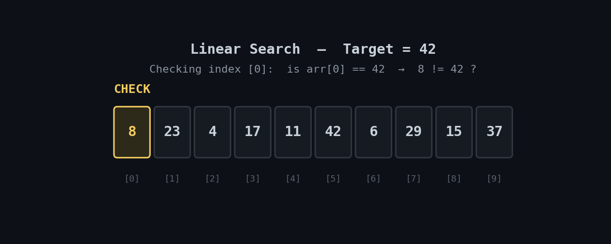

<h1 align="center">🔍 Linear Search</h1>

<p align="center">
  <i>A complete, beginner-friendly learning package for the Linear Search algorithm — concept, complexity, animated walkthrough, and two Python implementations (functional and OOP).</i>
</p>

<p align="center">
  
  
  
  
</p>

---

## 📽️ Visual Walkthrough

The animation below shows exactly how Linear Search checks each element, one at a time, from left to right, until it finds the target value.

<p align="center">
  
</p>

> 🟡 Amber = currently being checked · ⚪ Gray = checked, no match · 🟢 Green = target found

---

## 📖 What is Linear Search?

Linear Search (also called **Sequential Search**) is the simplest searching algorithm. It walks through a list **one element at a time**, from the beginning, comparing each element to the target value. If it finds a match, it returns that position. If it reaches the end without a match, it reports that the value isn't present.

It doesn't require the list to be sorted — its biggest advantage over algorithms like Binary Search, at the cost of being slower on large datasets.

---

## ⚙️ How It Works

1. Start at the first element of the list (index `0`).
2. Compare the current element with the target value.
3. If it matches → return the current index. Done.
4. If it doesn't match → move to the next index and repeat.
5. If the end of the list is reached with no match → return `-1` (not found).

---

## ⏱️ Complexity Analysis

| Case | Time Complexity | Description |
|---|---|---|
| **Best Case** | `O(1)` | Target is the first element |
| **Average Case** | `O(n)` | Target is somewhere in the middle |
| **Worst Case** | `O(n)` | Target is the last element, or not present at all |
| **Space Complexity** | `O(1)` | Search happens in place — no extra memory needed |

---

## 🧠 Pseudocode

```text
function linearSearch(array, target):
    for index from 0 to length(array) - 1:
        if array[index] == target:
            return index
    return -1   // not found
```

---

## 🐍 Implementation

This repo includes **two implementations** of the same algorithm — a simple function, and an object-oriented version with a small extra feature set.

### 1️⃣ Function-Based

```python
def linear_search(arr, target):
    for index, value in enumerate(arr):
        if value == target:
            return index  # Found
    return -1  # Not found


# Example
data = [10, 25, 37, 42, 53]
print(linear_search(data, 42))  # Output: 3
```

### 2️⃣ Object-Oriented

The `LinearSearch` class wraps the same logic in a small reusable structure, and adds two convenience methods: `contains()` for a quick boolean check, and `add()` to append new data and search again.

```python
class LinearSearch:
    """Simple Linear Search class implementation."""

    def __init__(self, data=None):
        self.data = data if data is not None else []

    def search(self, target):
        """Search for target and return index, or -1 if not found."""
        for index, value in enumerate(self.data):
            if value == target:
                return index
        return -1

    def contains(self, target):
        """Return True if target exists in the data, else False."""
        return self.search(target) != -1

    def add(self, value):
        """Append a new value to the data."""
        self.data.append(value)


# Example
searcher = LinearSearch([10, 25, 37, 42, 53])

print(searcher.search(42))      # Output: 3
print(searcher.search(99))      # Output: -1
print(searcher.contains(25))    # Output: True
print(searcher.contains(1))     # Output: False
print(searcher.contains(98))    # Output: False

# Add a new element and search again
searcher.add(99)
print(searcher.search(99))      # Output: 5
```

> 💡 See [`linear_search.py`](./linear_search.py) for the full file, and the lecture notes for a deeper explanation of the concept and complexity analysis.

---

## ▶️ Running It Locally

```bash
git clone https://github.com/zain-cs/1-Linear-Search.git
cd 1-Linear-Search
python linear_search.py
```

No external dependencies required — pure Python standard library.

---

## 📂 Repository Contents

| File | Description |
|---|---|
| `linear_search.py` | Function-based and OOP implementations of the algorithm |
| `Linear Search - Lecture.pdf` | Full concept explanation, complexity breakdown, and examples |
| `Linear Search - Lecture.docx` | Editable version of the lecture notes |

---

## 🗺️ Part of a DSA Learning Series

This repo is part of an ongoing series where I implement and document one Data Structures & Algorithms concept at a time — building a public, structured trail as I go through DSA.

📌 Explore more of the series on my [GitHub profile](https://github.com/zain-cs?tab=repositories).

---

<p align="center">
  Made with 🐍 by <a href="https://github.com/zain-cs">Muhammad Zain Ul Abidin</a>
</p>
